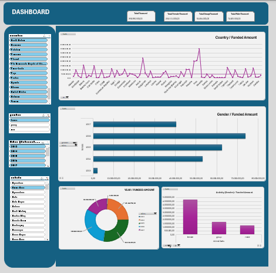

# 📊 Análisis de Datos y Dashboard Interactivo en Excel

## 📝 Descripción del Proyecto

Este proyecto tiene como objetivo aplicar una metodología completa de análisis de datos utilizando Microsoft Excel, abarcando desde la importación de datos hasta la creación de un dashboard interactivo.

Se estructura en tres fases principales:

1. **Importación y preparación de datos**
2. **Análisis de datos**
3. **Creación de un dashboard interactivo**

El objetivo es transformar datos brutos en información clara y accionable mediante visualizaciones dinámicas y KPIs.

---

## 📊 Dataset Utilizado

* **Dataset principal**: `kiva_loans.csv`. 
    (Utilizado: kiva_loans_42304_rows.csv)
* **Fuente**: Kaggle
* **Organización**: Kiva.org

Este dataset contiene información sobre préstamos concedidos a nivel global, incluyendo variables como importe, país, sector, género y plazos de devolución.

---

## 📌 KPIs del Dashboard

Para el diseño del dashboard se seleccionaron indicadores clave que permiten entender rápidamente el volumen y la distribución de los préstamos financiados:

* 💰 **Total Financed**: volumen total de préstamos financiados
* 👩 **Total Female Financed**: cantidad total financiada a mujeres
* 👥 **Total Group Financed**: cantidad total financiada a grupos
* 👨 **Total Male Financed**: cantidad total financiada a hombres

Estos KPIs ofrecen una visión rápida del impacto financiero segmentado por género y tipo de beneficiario.

---

## 📊 Visualizaciones del Dashboard

El dashboard incluye los siguientes gráficos:

* 🌍 **Country / Funded Amount**: gráfico de líneas con la evolución del importe financiado por país
* 👥 **Gender / Funded Amount**: gráfico de barras horizontales con la distribución del importe financiado por género
* 📅 **Year / Funded Amount**: gráfico de dona con la distribución del importe financiado por año
* 🏭 **Activity (Sector) / Funded Amount**: gráfico de barras con el importe financiado por sector de actividad

Además, se implementaron **segmentadores (slicers)** que permiten filtrar todos los gráficos de forma dinámica por:

* 🌍 País (`country`)
* 👤 Género (`gender`)
* 🔄 Tipo de pago (`repayment schedule`): monthly, irregular, bullet, weekly
* 🏭 Sector (`sector`)
* 📅 Año (`year`)

---

## 🛠️ Tecnologías Utilizadas

* Microsoft Excel
* Tablas dinámicas (Pivot Tables)
* Segmentadores (Slicers)
* Power Query (transformación de datos)

---
## 📦 Estructura del Proyecto

```
📁 proyecto1-analisisexcel-irene/
│
├── 📄 .gitignore
├── 📄 README.md
├── 📁 imagenes/dashboard.png
├── 📊 proyecto001.xlsx
├── 📁 data/
│   └── kiva_loans.csv
│   └── kiva_loans_42304_rows.csv
```

---

## ⚙️ Proceso de Desarrollo

### 1. Importación y Preparación

* Importación de datos en Excel
* Conversión a formato tabla
* Limpieza de datos (duplicados, ordenación, filtros)

### 2. Análisis de Datos

* Uso de tablas dinámicas para agregaciones
* Creación de métricas clave
* Análisis exploratorio

### 3. Creación del Dashboard

* Diseño visual con formas y KPIs
* Gráficos dinámicos conectados a tablas dinámicas
* Interactividad mediante segmentadores

---

## 🖥️ Vista del Dashboard



---

## ▶️ Cómo Usar el Proyecto

1. Abrir el archivo `proyecto001.xlsx`
2. Ir a la hoja **Dashboard**
3. Utilizar los **segmentadores** para filtrar datos por país, género, tipo de pago, sector y año
4. Analizar los cambios dinámicos en KPIs y gráficos

---

## 🚀 Conclusión

Este proyecto demuestra cómo Excel puede utilizarse como una herramienta completa de análisis de datos, permitiendo construir dashboards interactivos y visualmente atractivos sin necesidad de software adicional.

---


